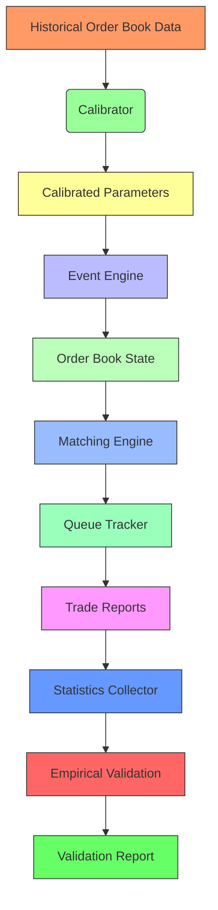
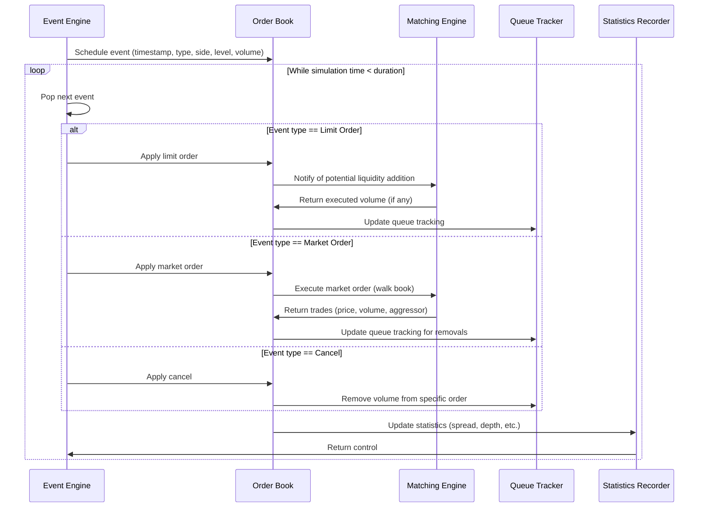

# Architecture Document: Queue-Reactive Limit Order Book Market Simulator

## 1. Repository Structure

```
queue-reactive-lob-simulator/
├── .github/
│   ├── ISSUE_TEMPLATE/
│   │   ├── bug_report.yml
│   │   └── feature_request.yml
│   └── PULL_REQUEST_TEMPLATE/
│       └── pr_template.md
├── data/
│   ├── raw/                  # Place for downloaded raw data (not tracked in Git)
│   ├── processed/            # Calibrated parameters, validation datasets
│   └── sample/               # Small sample datasets for CI/testing
├── docs/
│   ├── architecture.md       # This file
│   ├── datasets.md           # Data sources and preprocessing
│   ├── plan.md               # Implementation plan
│   ├── research.md           # Paper summaries and extensions
│   └── tasks.md              # Granular task list
├── scripts/
│   ├── calibrate.py          # Script to calibrate intensities from data
│   ├── validate.py           # Script to run validation and generate reports
│   └── download_data.sh      # Helper script to acquire sample data
├── src/
│   ├── core/                 # Core simulator engine (language-agnostic interface)
│   │   ├── order_book.hpp    # C++ header: OrderBook class definition
│   │   ├── event_engine.hpp  # C++ header: EventEngine class definition
│   │   ├── types.hpp         # C++ header: Shared types, enums, structs
│   │   └── utils.hpp         # C++ header: Utility functions
│   ├── calibration/          # Calibration module
│   │   ├── calibrator.cpp    # C++ implementation: parameter estimation
│   │   ├── calibrator.hpp    # C++ header
│   │   └── calibrator_py.cpp # C++/Python bindings (if using pybind11)
│   ├── matching/             # Matching engine and queue tracking
│   │   ├── matching_engine.cpp
│   │   ├── matching_engine.hpp
│   │   ├── queue_tracker.cpp
│   │   └── queue_tracker.hpp
│   ├── python/               # Python research layer
│   │   ├── __init__.py
│   │   ├── calibrator.py     # Python wrapper for calibrator
│   │   ├── simulator.py      # Python wrapper for simulator
│   │   └── validator.py      # Python wrapper for validator
│   └── utils/                # Cross-cutting utilities
│       ├── logger.hpp
│   │   └── config_parser.hpp
├── tests/
│   ├── unit/                 # Unit tests for individual modules
│   │   ├── test_order_book.cpp
│   │   ├── test_event_engine.cpp
│   │   └── test_calibrator.cpp
│   ├── integration/          # Integration tests
│   │   ├── test_simulation_loop.cpp
│   │   └── test_calibration_validation.py
│   └── empirical/            # Empirical validation tests
│       ├── test_spread_distribution.py
│   │   └── test_depth_profile.py
├── .gitignore
├── CMakeLists.txt            # C++ build configuration
├── LICENSE
├── README.md
└── pyproject.toml            # Python project configuration (if applicable)
```

*Note: The above structure assumes a C++ core with Python bindings. A Rust implementation would follow a similar modular layout.*

## 2. Module Responsibilities

### 2.1 Core Module (`src/core/`)
- **OrderBook Class**:  
  - Responsibility: Maintain the limit order book state as a vector of queue sizes at multiple bid and ask levels.  
  - Key Methods:  
    - `apply_limit_order(level, volume, side)`: Add volume to the queue at the specified level and side.  
    - `apply_market_order(volume, side)`: Remove volume from the book starting at the best level on the given side, walking the book as needed.  
    - `apply_cancel(level, volume, side)`: Remove volume from the queue at the specified level and side (if sufficient volume exists).  
    - `get_queue_size(level, side)`: Return the current queue size at the given level and side.  
    - `get_midprice()`: Compute the midprice from the best bid and ask.  
    - `get_spread()`: Compute the bid-ask spread in ticks.  
    - `is_best_bid_empty()` / `is_best_ask_empty()`: Check if the best bid or ask queue is depleted.  
- **EventEngine Class**:  
  - Responsibility: Drive the simulation by processing events in chronological order.  
  - Key Methods:  
    - `schedule_event(timestamp, event_type, level, side, volume)`: Insert an event into the priority queue.  
    - `run_simulation(duration)`: Process events until the simulation time reaches `duration`.  
    - `get_current_time()`: Return the simulation clock.  
    - `clear()`: Reset the engine for a new run.  
- **Types and Utilities (`types.hpp`, `utils.hpp`)**:  
  - Define enums (`EventType::{LimitOrder, MarketOrder, Cancel}`, `Side::{Bid, Ask}`), structs (`OrderBookState`, `Trade`, `Event`), and utility functions (e.g., price tick conversion).

### 2.2 Calibration Module (`src/calibration/`)
- **Calibrator Class**:  
  - Responsibility: Estimate state-dependent intensities from historical order book data.  
  - Key Methods:  
    - `fit(data)`: Compute \(\hat{\lambda}_i(q) = N_i(q) / T(q)\) for each event type \(i\) and state \(q\).  
    - `save_parameters(path)`: Serialize the calibrated intensities to a file.  
    - `load_parameters(path)`: Load calibrated intensities from a file.  
    - `get_intensity(event_type, state)`: Return the estimated intensity for a given event type and state.  
- **State Discretization Helper**:  
  - Responsibility: Map continuous or high-dimensional book states to a discrete set for intensity estimation (e.g., by binning queue sizes or using features like total depth, imbalance).  
  - Key Methods:  
    - `discretize(state)`: Return a discrete state identifier.  
    - `undiscretize(discrete_id)`: Return a representative continuous state (for simulation).

### 2.3 Matching Module (`src/matching/`)
- **MatchingEngine Class**:  
  - Responsibility: Execute trades according to exchange matching rules (price-time priority, pro-rata if applicable).  
  - Key Methods:  
    - `execute_market_order(volume, side)`: Match a market order against the book, returning a list of trades.  
    - `execute_limit_order(price, volume, side)`: Attempt to add a limit order; if immediately executable, match as per rules; otherwise, add to the book.  
    - `get_best_bid()` / `get_best_ask()`: Return the best bid/ask price and volume.  
- **QueueTracker Class**:  
  - Responsibility: Track the position of individual orders in the queue to handle partial fills and cancellations accurately.  
  - Key Methods:  
    - `insert_order(order_id, level, side, volume)`: Add a new order to the queue at the given level and side.  
    - `remove_order(order_id, level, side, volume)`: Remove volume from a specific order's position.  
    - `get_position(order_id)`: Return the current queue position (number of orders ahead) for a given order ID.  
    - `get_volume_ahead(level, side, position)`: Return the total volume standing ahead of a given position.

### 2.4 Python Research Layer (`src/python/`)
- ** simulator.py **:  
  - Responsibility: High-level interface to run simulations, configure parameters, and collect statistics.  
  - Key Methods:  
    - `run(duration, calibrated_params=None)`: Execute a simulation for the given duration.  
    - `calibrate(data_path)`: Run the calibration routine on historical data.  
    - `validate(data_path)`: Run empirical validation and return a report.  
    - `get_statistics()`: Return a dictionary of simulated market statistics.  
- ** calibrator.py ** and ** validator.py **:  
  - Responsibility: Python wrappers for the C++ calibration and validation modules, enabling use in research scripts and Jupyter notebooks.

### 2.5 Utilities (`src/utils/`)
- **ConfigParser**: Reads YAML/JSON configuration files for simulator settings.
- **Logger**: Simple logging utility for simulation progress and debugging.

## 3. Data Flow Diagrams

### 3.1 Overall Simulation Flow


### 3.2 Event Processing Flow


## 4. External Data Sources

See `DATASETS.md` for a comprehensive list. Summary:

- **Primary Data Source**: Historical limit order book data from exchanges (e.g., NASDAQ, EURONEXT) or aggregated providers (LOBSTER, Kaggle, Quantopian).  
  - Acquisition: Download via HTTP/FTP or use provided APIs.  
  - Format: Typically CSV or binary packets containing timestamp, event type, side, price, volume.  
  - Preprocessing: Convert to a unified schema (timestamp, event_type, side, price_level, volume). Filter for liquid trading hours and remove invalid entries.  
  - Licensing: Varies; check each dataset for commercial use restrictions.

- **Secondary Data**: Reference prices (e.g., midprice from consolidated tape) for validating price dynamics.  
  - Acquisition: Often included in LOB data or computed from best bid/ask.

- **Calibration Output**: JSON file containing estimated intensities \(\hat{\lambda}_i(q)\) for discrete states.

## 5. Performance Targets

- **Simulation Throughput**: > 500,000 events per second on a modern 3.0 GHz CPU (single-threaded).  
- **Latency**: Average event processing time < 2 µs.  
- **Memory Footprint**: < 100 MB for a book with 10 levels on each side and 1 million events in memory.  
- **Determinism**: Identical output given the same input data and random seed.  
- **Calibration Time**: < 5 minutes for a dataset of 10 million events on a standard laptop.

## 6. Testing Strategy

### 6.1 Unit Tests
- **Scope**: Individual classes and functions in isolation.  
- **Framework**: Google Test (C++) and pytest (Python).  
- **Coverage Goal**: >90% for core modules (OrderBook, EventEngine, MatchingEngine), >80% for calibration and validation.  
- **Examples**:  
  - Test that a limit order increases the correct queue size.  
  - Test that a market order consumes liquidity from the best ask first.  
  - Test that the Calibrator returns non-negative intensities.  
  - Test that the QueueTracker correctly reports position after insertions and removals.

### 6.2 Integration Tests
- **Scope**: Interactions between modules (e.g., event engine + order book + matching engine).  
- **Framework**: Same as unit tests, but testing end-to-end workflows.  
- **Examples**:  
  - Feed a predefined sequence of events and verify the final book state and trade reports.  
  - Run a calibration-validation loop on a sample dataset and check that simulated statistics are within 20% of empirical values.

### 6.3 Empirical Validation Tests
- **Scope**: Compare simulator output to real-world statistics.  
- **Framework**: Python scripts using scipy for statistical tests (e.g., Kolmogorov-Smirnov, chi-square).  
- **Validation Metrics**:  
  - Spread distribution (CDF comparison).  
  - Depth profile at each level (mean and variance).  
  - Queue depletion times (exponential fit parameter).  
  - Fill probability by queue position (should decrease monotonically).  
  - Price move probability after imbalance (should correlate with order flow imbalance).  
- **Acceptance Threshold**: Simulated statistics should pass a two-sample Kolmogorov-Smirnov test with p-value > 0.05 (indicating no significant difference) for at least 80% of metrics.

### 6.4 Continuous Integration
- **Trigger**: On every push and pull request.  
- **Steps**:  
  1. Install dependencies.  
  2. Build the C++ core (if applicable).  
  3. Run unit and integration tests.  
  4. Run empirical validation on a small sample dataset.  
  5. Upload coverage report.  
- **Tools**: GitHub Actions (yaml workflows in `.github/workflows/`).

## 7. Dependencies and External Tools

- **Build System**: CMake 3.15+ (for C++), or Cargo (for Rust).  
- **Core Language**: C++20 (with concepts) or Rust 2021 edition.  
- **Python Bindings**: pybind11 (if using C++) or rust-cpython (if using Rust).  
- **Python Libraries**: polars (≥0.15), numpy (≥1.20), scipy (≥1.7), pyarrow (≥5.0), pytest (≥6.0).  
- **Testing**: Google Test (≥1.10), pytest.  
- **Documentation**: Doxygen (for C++), Sphinx (for Python).  
- **Version Control**: Git, with GitHub for hosting.

## 8. Future Extensions

- **GPU Acceleration**: Offload intensity evaluation or batch event processing to CUDA kernels.  
- **Distributed Simulation**: Run multiple independent simulations in parallel for parameter sweeps.  
- **Machine Learning Integration**: Replace intensity estimation with a neural network that predicts \(\lambda_i(q)\) from raw features.  
- **Web Interface**: Provide a lightweight web dashboard for real-time simulation visualization.
